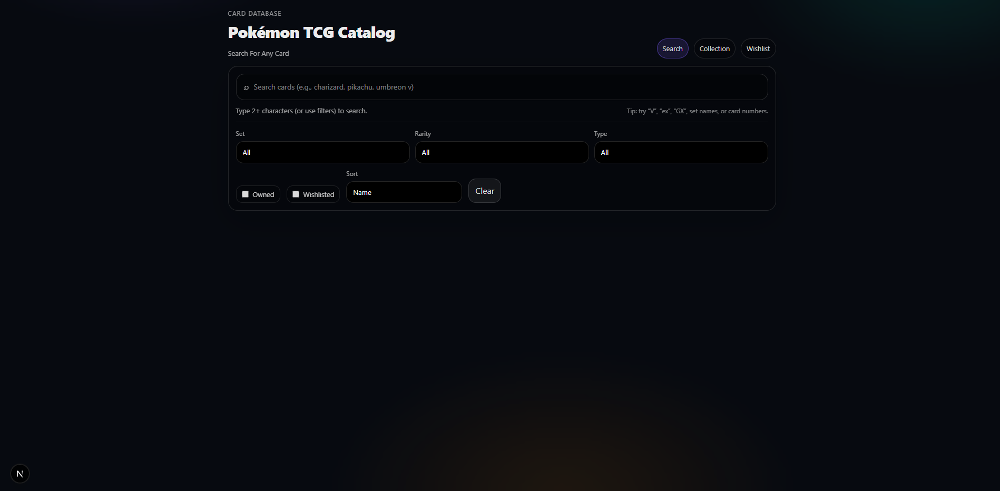
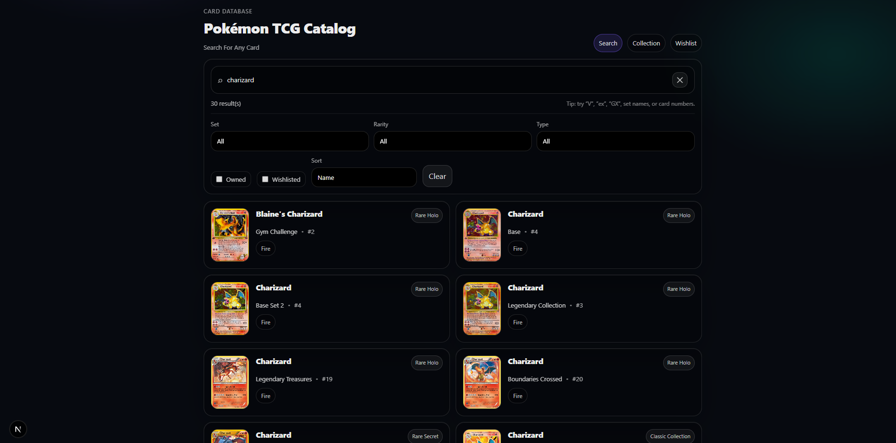
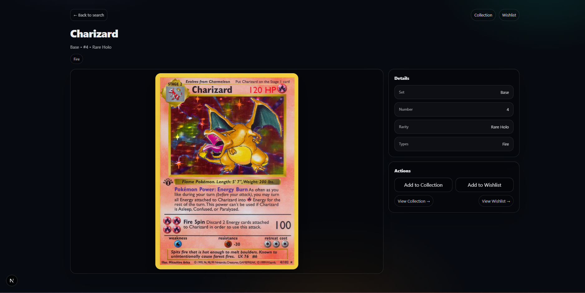
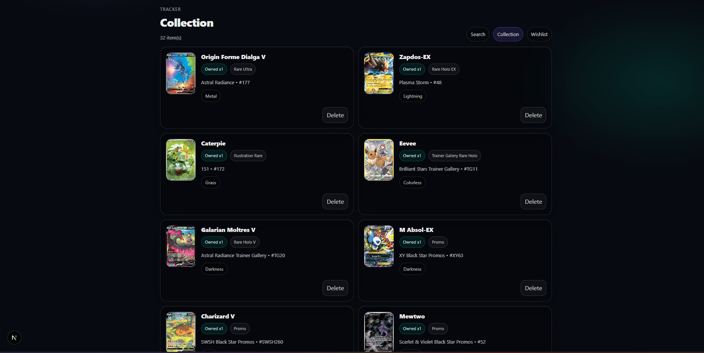
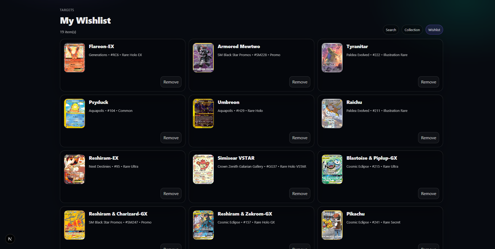

# Pokémon TCG Catalog & Collection Tracker

A full-stack web application for browsing, searching, and managing a Pokémon TCG card collection.

Built to mirror real production features such as full-text search, filtering, pagination, and persistent local data.


## Screenshots

### Search Interface


### Search Results


### Card Detail Page


### Collection View


### Wishlist View


---

## Features

- Full-text card search
- Filtering by set, rarity, type, owned status, and wishlisted status
- Collection tracking with quantity support
- Wishlist management
- Collection statistics (unique cards, total quantity, top types)
- Card detail pages with images and metadata
- Fully responsive, dark-themed UI

---


## Tech Stack

- Frontend: Next.js, React, TypeScript
- Backend: Next.js API Routes
- Database: SQLite 

---

## Architecture Highlights

- RESTful API routes with efficient SQL joins for derived data (collection and wishlist badges)
- Deterministic pagination and stable sorting for consistent results
- SQLite FTS5 for fast, scalable offline text search
- Clear separation of concerns between UI components, API logic, and database access
- State-driven UI with graceful loading and error handling

---

## Running Locally

npm install  
npm run dev  

---

## Project Structure

```text
app/
├─ api/
│  ├─ search-cards/          # SQLite FTS search endpoint
│  ├─ filters/               # Filter dropdown data (sets, rarities, types)
│  ├─ collection/            # Collection CRUD API
│  ├─ wishlist/              # Wishlist CRUD API
│  └─ img/                   # Image proxy (avoids CORS issues)
│
├─ components/
│  ├─ TopNav.tsx             # Navigation bar
│  ├─ FilterBar.tsx          # Search filters UI
│  ├─ CardActions.tsx        # Add/remove collection & wishlist
│
├─ cards/
│  └─ [id]/
│     └─ page.tsx            # Card detail page
│
├─ collection/
│  └─ page.tsx               # Collection page
│
├─ wishlist/
│  └─ page.tsx               # Wishlist page
│
├─ page.tsx                  # Home search page
│
lib/
├─ db.ts                     # SQLite setup, schema, migrations, FTS helpers
├─ cache.ts                  # Simple in-memory caching utilities
│
scripts/
└─ seedCatalog.ts            # Seeds SQLite from Pokémon TCG JSON data
```

---

## Data & Database Setup

This project is offline-first and uses a local SQLite database populated from the Pokémon TCG JSON dataset.

The raw card data and generated database are intentionally excluded from the repository.

### Data Source

Pokémon TCG JSON dataset:  
https://github.com/PokemonTCG/pokemon-tcg-data

### Local Setup

1. Download the Pokémon TCG JSON data (English)
2. Place it in:

```text
data/pokemon-tcg-data/
```

3. Seed the database:

```bash
npm run seed
```

This generates:

- data/app.db (SQLite database with FTS indexes)

After seeding, the app runs fully offline with fast local search.

---

## Future Improvements

- [✅] Delete button for wishlist
- [ ] Advanced sorting (price, release date, card number grouping)
- [ ] Deck builder feature
- [ ] Export collection to CSV / JSON
- [ ] Visual analytics (charts for set/type distribution)
- [ ] Pricing

---
